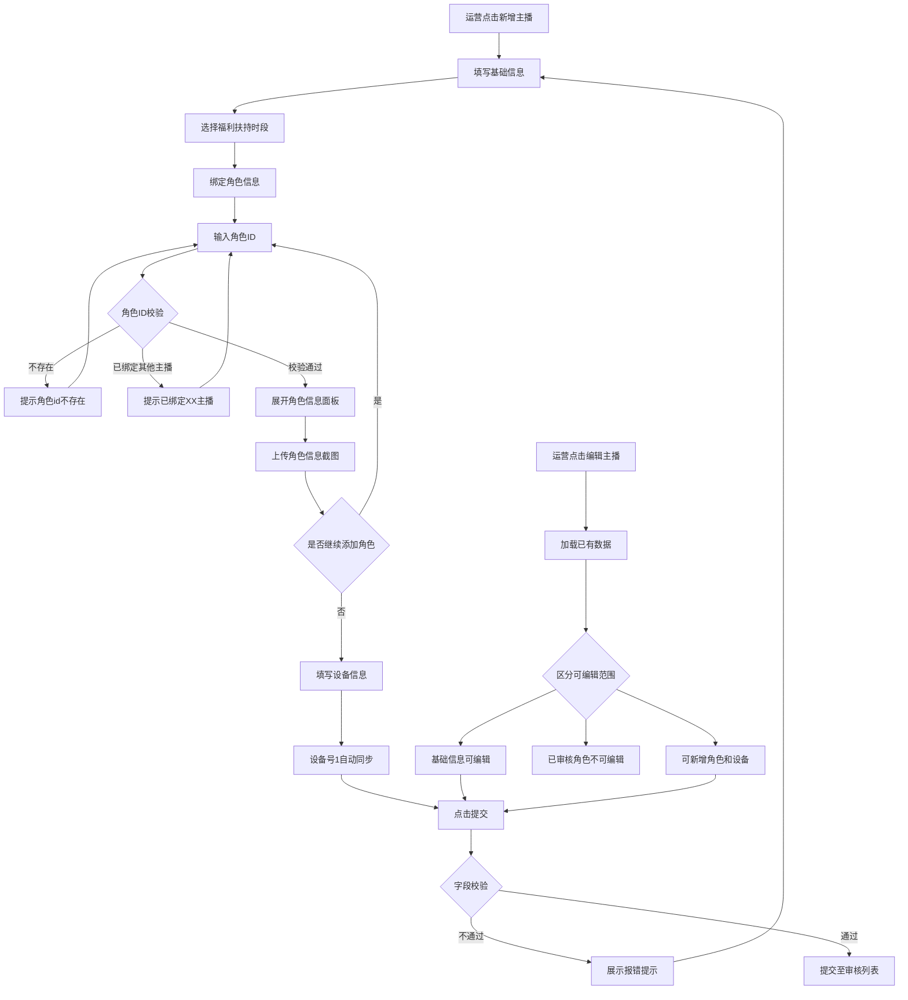

# 范例：主播号管理 — 新增/编辑主播信息（v3.1.16）

> 本文件是一份已验证的表单类标准化需求文档范例，供 AI 生成时参考输出质量和格式标准。
> 覆盖场景：多区域分组表单、动态新增/删除、字段联动、复杂校验、二次确认弹窗、新增/编辑差异、业务流程图。

---

> **变更说明：**
> - 黑色文字：v1.0 初始版本（2026-04-20，张静）

---

## 一、需求概述

| 字段 | 内容 |
|------|------|
| **需求名称** | 主播号管理 — 新增/编辑主播信息 |
| **需求描述** | 提供主播基础信息配置、角色绑定及设备信息管理的新增与编辑页面，支持角色验证、福利扶持配置及设备自动同步 |
| **需求类型** | 🔘 新增功能 |
| **关联系统/游戏** | 远征手游运营后台 |
| **版本号** | v3.1.16 |
| **优先级** | 🔘 P1-高 |
| **提出人** | 张静 / 能力中心-IT平台部-产品部 |
| **提出时间** | 2026-04-20 |

---

## 二、需求背景与目标

**背景：** 运营团队需要对合作主播进行统一管理，包括主播基本信息录入、游戏角色绑定、福利扶持配置以及设备信息记录。目前主播信息的录入和维护流程缺少标准化的配置入口，角色绑定的校验和状态管理需要系统化支持。

**目标：** 提供一个完整的主播信息新增/编辑表单页面，支持基础信息填写、角色绑定验证、福利扶持时段配置和设备信息同步，确保主播数据的准确性和可管理性。

**价值：** 实现主播信息的标准化录入与管理，通过角色ID自动验证和设备信息自动同步，减少人工核对成本，降低数据录入错误率。

---

## 三、需求详设

### 3.1 新增/编辑主播信息

**功能介绍：** 主播基础信息以及绑定的主播号配置、编辑页面。

**功能入口：** 侧边栏 → 一级菜单 → 二级菜单 → 点击「新增」按钮进入新增页面；点击列表行内「编辑」按钮进入编辑页面。

**页面整体说明：**
- 页面分为四个区域：基础信息、福利扶持信息、绑定角色信息、设备信息
- 带 * 标记的为必填项
- 页面支持实时保存（底部展示"实时保存：YYYY-MM-DD HH:mm:ss"）
- 二次编辑时，仅允许新增主播【基本信息】和【设备白名单信息】和新增角色信息。已审核通过的角色信息不可编辑和删除，包括截图、角色类型、角色校验等

---

#### 3.1.1 基础信息

| 字段名 | 功能说明 | 组件类型 | 必填 | 限制 | 数据来源 | 备注/说明 |
|--------|---------|---------|------|------|---------|----------|
| 主播昵称 | 主播昵称输入 | 输入框 | 是 | 最多8个字符；限制表情符号等输入 | 手动输入 | 【占位提示】请输入主播昵称 【校验规则】超过部分截断不展示；为空时提示："请输入主播昵称"；校验名称唯一性，重复时提示："主播昵称已存在，请重新输入" |
| 真实姓名 | 主播真实姓名输入 | 输入框 | 是 | 最多8个字符；限制表情符号等输入 | 手动输入 | 【占位提示】请输入真实姓名 【校验规则】超过部分截断不展示；为空时提示："请输入主播真实姓名" |
| 身份证号 | 主播身份证录入 | 输入框 | 是 | 18位数字、字母；限制非数字字母输入 | 手动输入 | 【占位提示】请输入身份证号 【校验规则】超过部分截断不展示；为空时提示："请输入主播身份证号"；输入后校验身份证信息的准确性，否则提示："身份证信息无效" |
| 主播类型 | 主播类型选择 | 下拉框 + 输入框 | 是 | 允许20个字符输入；限制表情符号等输入 | 已配置的主播类型 | 【占位提示】请选择类型 【特殊说明】支持下拉选择或输入搜索主播类型（排序：按照创建倒序时间）；支持录入新增主播类型，超过部分截断不展示；为空时提示："请输入主播类型" |
| 合作状态 | 主播合作状态选择 | 单选 | 是 | / | 枚举：合作中、暂停合作 | 【默认值】合作中 【特殊说明】合作中：指该主播正处于正常运行状态，其绑定的主播号可以正常使用且发送福利；暂停合作：指该主播已经未运行状态，其绑定的主播号未为封号状态且不能发放福利 |
| 直播运营 | 主播所对应的管理运营 | 下拉框 + 输入框 | 是 | 最多8个字符；限制表情符号等输入 | 已配置的直播运营列表 | 【占位提示】请输入直播运营 【特殊说明】支持下拉选择或输入搜索直播运营（排序：按照创建倒序时间）；支持录入新增直播运营，超过部分截断不展示；为空时提示："请输入直播运营" |
| 备注说明 | 备注信息 | 文本域 | 否 | 最多100个字符 | 手动输入 | 【特殊说明】超过部分截断不展示；右下角展示字数统计"已输入/100" |

---

#### 3.1.2 福利扶持信息

| 字段名 | 功能说明 | 组件类型 | 必填 | 限制 | 数据来源 | 备注/说明 |
|--------|---------|---------|------|------|---------|----------|
| 主播福利扶持时段 | 选择该主播的福利扶持时段 | 下拉框 | 是 | / | 已配置的扶持时段 | 【占位提示】请选择扶持时段 |

---

#### 3.1.3 绑定角色信息

**区域整体说明：**
- 页面初始化默认保留一个角色绑定区域（主播角色1），可在此基础上点击【新增】按钮新增角色2、角色3...
- 最大上限为 99 个角色绑定，超过不可新增
- 新增角色时，需确认当前字段是否已填，如必填字段为空时，不可新增，对应字段提示填写内容
- 角色之间按序号排列（主播角色1、主播角色2、...），删除后下一个角色序号自动替代当前删除的序号

**操作按钮：**

| 按钮名称 | 入口位置 | 触发条件 | 交互行为 |
|----------|---------|---------|---------|
| 新增 | 角色列表底部 | 角色数未达上限（99个）且当前必填字段已填写 | 点击后在最后一个角色下方新增一个空的角色绑定区域 |
| 隐藏/展开角色 | 「新增」按钮右侧 | 常驻显示 | 展示或隐藏封禁状态的角色 |
| 删除 | 角色标题右侧 | 仅未审核通过的角色显示 | 点击后删除该角色及配置信息，下一个角色序号自动替代 |
| 解绑 | 角色标题右侧（「删除」按钮右侧） | 仅审核通过的角色显示 | 点击后弹出二次确认弹窗（见下方解绑弹窗说明） |

**解绑主播角色弹窗：**
- 弹窗标题：解绑主播角色
- 弹窗内容（橙色警告文案）："解除角色与主播的绑定后，将中止该角色的福利发放，此操作不可撤回，是否继续？"
- 操作按钮：「取消」关闭弹窗；「解绑」确认解绑，角色状态变为"解绑中"

**每个角色绑定区域的字段说明：**

| 字段名 | 功能说明 | 组件类型 | 必填 | 限制 | 数据来源 | 备注/说明 |
|--------|---------|---------|------|------|---------|----------|
| 角色类型 | 角色号类型选择 | 下拉框 + 输入框 | 是 | 最多8个字符；限制表情符号等输入 | 已配置的角色类型 | 【占位提示】请选择类型 【特殊说明】支持下拉选择或输入搜索角色号类型（排序：按照创建倒序时间）；支持录入新增角色号类型，超过部分截断不展示；为空时提示："请输入角色类型"；角色号类型为"签约主播"（云类型默认勾选）时，最多只能绑定X个，其他类型不限数量，可持续添加 |
| 角色信息 | 输入角色ID进行绑定验证 | 输入框 + 验证按钮 | 是 | 限制非数字输入 | 手动输入 + 游戏服务器验证 | 【占位提示】请输入角色ID 【校验规则】为空时提示："请输入角色id"；输入角色ID并光标离开输入框后，自动进行校验：①校验角色ID是否存在 → 不存在提示："角色id不存在"；②校验该角色是否在当前角色所在的游戏联服下已绑定主播 → 已绑定提示："该联服下已绑定XX（主播昵称）主播，不可添加"；③当前区服已存在1个常规号 → 提示："当前区服已存在1个常规号" 【特殊说明】校验通过后展示角色信息面板（见下方角色信息面板说明）；二次编辑时，角色校验按钮消失，角色信息展示区域可收起/展开 |
| 角色信息截图 | 角色信息截图上传 | 上传组件 | 是 | 数量为1；文件限制2M以内；仅支持 png/jpg 格式 | 手动上传 | 【校验规则】为空或文件不符合上传条件时提示："请上传2m以内的png/jpg文件" |

**角色信息面板（验证通过后展示）：**

> 角色ID校验通过后，自动展开角色信息面板，展示以下数据。面板支持收起/展开操作。二次编辑模式支持收起，刷新字段获取最新数据。

| 字段名 | 功能说明 | 展示格式 | 数据来源 |
|--------|---------|---------|---------|
| 角色信息 | 角色ID + 角色名称 | 角色id=角色名称，角色id=主播号标识 | 游戏服务器 |
| 所属区服 | 该角色的区服ID + 区服名称 | 区服ID（区服名称） | 游戏服务器 |
| 游戏账号ID | 该角色的游戏账号ID | 数字 | 游戏服务器 |
| 创角时间 | 该角色的创建时间 | YYYY.MM.DD HH:mm:ss | 游戏服务器 |
| 实际充值金额 | 实际充值金额 | X元 | 游戏服务器 |
| 累计充值金额 | 累计充值总额（含多种渠道） | X元 | 游戏服务器 |
| 最后登录时间 | 该角色最后登录时间 | YYYY.MM.DD HH:mm:ss，精确展示至分秒 | 游戏服务器 |
| 在线状态 | 当前在线状态 | 在线/离线 | 游戏服务器 |
| 开服日期 | 所在区服的开服日期 | YYYY.MM.DD | 游戏服务器 |
| 创角时开服天数 | 创角时距离开服的天数 | X天 | 游戏服务器 |
| 常用设备1 | 历史最近的第1台登录设备 | uuid: xxx ip: xxx ip归属地: xxx | 游戏服务器 |
| 常用设备2 | 历史最近的第2台登录设备 | uuid: xxx ip: xxx ip归属地: xxx | 游戏服务器 |
| 常用设备3 | 历史最近的第3台登录设备 | uuid: xxx ip: xxx ip归属地: xxx | 游戏服务器 |
| 身份信息 | 实名认证身份证号（脱敏） | 前6位 + **** + 后4位，如：440545********1212 | 游戏服务器 |

**累计充值金额计算规则：**

> 累计充值金额 = 游戏内充值 + 三方支付网页购买红钻 + 沙金套餐；
> 模拟充值 = 真实充值（苹果补单 + 内部账号充值） + 沙金充值

**角色封禁状态说明：**
- 新增并审核通过的角色，在角色类型右侧显示角色封禁状态标签：使用中 / 封号中 / 解绑中

---

#### 3.1.4 设备信息

| 字段名 | 功能说明 | 组件类型 | 必填 | 限制 | 数据来源 | 备注/说明 |
|--------|---------|---------|------|------|---------|----------|
| 主播常驻地 | 主播常驻所在地 | 输入框 | 否 | / | 手动输入 | 【占位提示】请输入主播常驻地 |
| 设备号1 | 主播主设备信息（uuid / IP / IP归属地） | 输入框组（3个） | 是 | / | 自动同步 + 手动输入 | 【特殊说明】自动同步角色信息中主播号1验证通过的常用设备1信息；若主播号1-角色信息有3个设备信息，则3个均同步至主播设备号1-2-3；创建时不可编辑，只同步；设备号输入完成后，会校验展示其IP地址及IP归属地；支持手动输入/修改 |
| 使用设备 | 设备号1对应的使用设备信息 | 输入框 | 否 | / | 手动输入 | 【占位提示】请输入设备信息 |
| 设备号2 | 第二台设备信息（uuid / IP / IP归属地） | 输入框组（3个） | 否 | / | 手动输入 | 【占位提示】请输入设备uuid / 请输入IP / 请输入IP归属地 【特殊说明】二次修改时可编辑设备号字段 |
| 使用设备 | 设备号2对应的使用设备信息 | 输入框 | 否 | / | 手动输入 | 【占位提示】请输入设备信息 |
| 设备号3 | 第三台设备信息（uuid / IP / IP归属地） | 输入框组（3个） | 否 | / | 手动输入 | 【占位提示】请输入设备uuid / 请输入IP / 请输入IP归属地 【特殊说明】二次修改时可编辑设备号字段 |
| 使用设备 | 设备号3对应的使用设备信息 | 输入框 | 否 | / | 手动输入 | 【占位提示】请输入设备信息 |

---

#### 3.1.5 页面底部操作

| 按钮名称 | 入口位置 | 触发条件 | 交互行为 |
|----------|---------|---------|---------|
| 提交 | 页面底部右侧 | 常驻显示 | 点击后验证上述各字段输入的准确性：正确则提交记录至审核列表，关闭弹窗；错误则展示对应报错提示 |
| 重置 | 「提交」按钮左侧 | 常驻显示 | 点击后清空当前填写内容 |

---

#### 3.1.6 二次编辑规则

| 区域 | 二次编辑规则 |
|------|------------|
| 基础信息 | 允许编辑所有字段 |
| 福利扶持信息 | 允许编辑 |
| 绑定角色信息 - 已审核通过的角色 | **不可编辑、不可删除**，包括截图、角色类型、角色校验等；仅显示「解绑」按钮 |
| 绑定角色信息 - 未审核通过的角色 | 允许编辑和删除 |
| 绑定角色信息 - 新增角色 | 允许新增新的角色绑定 |
| 设备白名单信息 | 允许新增和编辑 |

---

#### 3.1.7 业务流程图

---

## 四、权限说明

| 权限项 | 控制范围 |
|--------|---------|
| `anchor:view` | 控制「主播号管理」菜单的可见性及页面访问权限 |
| `anchor:create` | 控制列表页「新增」按钮的显隐 |
| `anchor:edit` | 控制列表行内「编辑」按钮的显隐 |
| `anchor:unbind` | 控制角色绑定区域「解绑」按钮的显隐 |

---

## 五、通用功能说明

本页面为表单页，不涉及导出、列设置和分页功能。
