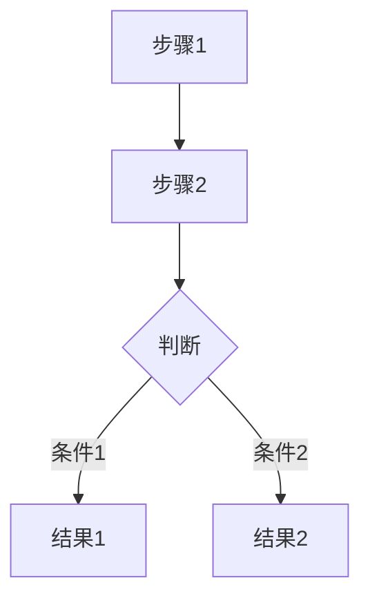

# {需求名称}（{版本号}）

---

> **变更说明：**
> - 黑色文字：v1.0 初始版本（YYYY-MM-DD，xxx）
> - 🔵 蓝色文字：vX.X 新增内容（YYYY-MM-DD，xxx）
> - 🟠 橙色文字：vX.X 修改内容（YYYY-MM-DD，xxx）
> - ~~删除线~~：vX.X 删除内容（YYYY-MM-DD，xxx）

---

## 一、需求概述

| 字段 | 内容 |
|---|---|
| **需求名称** | {简明扼要的标题} |
| **需求描述** | {一句话概括核心诉求} |
| **需求类型** | ○ 新增功能 / ○ 功能优化 / ○ 缺陷修复 |
| **关联系统/游戏** | {所属后台系统或游戏名称} |
| **版本号** | {版本号} |
| **优先级** | ○ P0-紧急 / ○ P1-高 / ○ P2-中 / ○ P3-低 |
| **提出人** | {姓名 / 部门} |
| **提出时间** | {YYYY-MM-DD} |

**一句话概括核心诉求：** {补充一句话概括}

---

## 二、需求背景与目标

**背景：** {当前业务现状是什么，存在什么问题或痛点}

**目标：** {这次要做什么，达到什么效果}

**价值：** {做了之后对运营/业务/技术带来什么好处}

---

## 三、需求详设

> 按功能点逐个展开。一个页面类型可以拆成多个功能点；例如“主播信息管理”可以拆成“查询项”“列表”“新增主播”“批量新增”“详情页”等多个功能点分别描述。

---

### 3.1 {功能点名称}

**功能介绍：** {一句话说明本功能点用途}

**功能入口：** {从哪里进入 / 菜单路径 / 页面入口}

#### 3.1.1 查询项

| 字段名 | 功能说明 | 组件类型 | 必填 | 限制 | 数据来源 | 备注/说明 |
|--------|---------|---------|------|------|---------|----------|
| {字段} | {说明} | {组件} | / | / | {来源} | {按标签规范填写} |

**查询按钮：**

| 按钮名称 | 入口位置 | 触发条件 | 交互行为 |
|----------|---------|---------|---------|
| 查询 | 查询区域右侧 | 常驻显示 | 点击后按当前查询条件刷新列表数据 |
| 重置 | 查询按钮右侧 | 常驻显示 | 点击后清空所有查询条件，恢复默认状态，并刷新列表 |

查询项填写规则：

- 每个查询项都要写明字段名、功能说明、组件类型、是否必填、限制、数据来源、备注/说明
- 查询项要说明默认值、占位提示、联动逻辑、是否支持清空
- 如果查询项支持多选、范围、级联、模糊搜索，要写清楚
- 如果查询项影响列表结果的展示规则，要写明
- 如果查询区有导出、展开/收起、高级筛选等按钮，要单独写按钮行为

#### 3.1.2 列表说明

| 字段名 | 功能说明 | 组件类型 | 必填 | 限制 | 数据来源 | 备注/说明 |
|--------|---------|---------|------|------|---------|----------|
| {字段} | {说明} | {组件} | / | / | {来源} | {按标签规范填写} |

**排序规则：** {默认排序方式}

**字段排序功能：**

支持排序的字段：{字段1}、{字段2}、...（在字段名后标注排序图标 ↕）

排序交互规则：
- 点击表头字段，按 **倒序 → 正序 → 默认** 的顺序循环切换
- 第一次点击：倒序（↓），按该字段从大到小 / 从新到旧排列
- 第二次点击：正序（↑），按该字段从小到大 / 从旧到新排列
- 第三次点击：恢复默认排序
- 同一时间只支持单字段排序，点击新字段时自动重置其他字段的排序状态

列表说明填写规则：

- 每一列都要说明功能和数据来源
- 如果列支持点击跳详情，要写清楚跳转目标
- 如果列支持复制、展开、省略展示，要写清楚
- 如果列是状态、标签、图标、数字统计类，要说明展示规则
- 空数据展示、超长文本省略、换行规则要写清楚
- 如果有列设置，要说明默认展示列和可配置列

#### 3.1.3 操作功能

| 按钮名称 | 入口位置 | 触发条件 | 交互行为 |
|----------|---------|---------|---------|
| {按钮} | {位置} | {条件} | {行为描述} |

操作功能填写规则：

- 每个操作按钮都单独写
- 要写清楚入口位置、触发条件、权限控制、状态限制、二次确认、操作结果
- 如果按钮点击后跳转表单页、详情页或弹窗，要写清楚入口和返回逻辑
- 如果是批量操作，要写明勾选规则、最多选择数量、是否跨页选择、无选择时提示

#### 3.1.4 {表单名称}（如有表单）

**入口：** {从哪里进入}

| 字段名 | 功能说明 | 组件类型 | 必填 | 限制 | 数据来源 | 备注/说明 |
|--------|---------|---------|------|------|---------|----------|
| {字段} | {说明} | {组件} | {是/否} | {限制} | {来源} | {按标签规范填写} |

表单填写规则：

- 表单区按模块拆开写，不要把所有字段混在一起
- 每个字段都要写清楚功能说明、组件类型、必填、限制、数据来源、备注/说明
- 备注/说明必须使用标签规范：
  - 【默认值】
  - 【占位提示】
  - 【校验规则】
  - 【联动逻辑】
  - 【特殊说明】
- 必填项必须明确
- 限制要写清楚长度、格式、枚举范围、数值范围、唯一性等
- 如果字段之间有联动，必须明确前置条件和联动结果
- 如果字段在新增和编辑态表现不同，要单独说明
- 如果表单项需要分组、折叠、分步提交，要写清楚结构
- 如果有“保存”“取消”“下一步”“上一步”等按钮，要说明交互行为和提交结果

#### 3.1.5 {详情页}（如有详情页）

**入口：** {从哪里进入}

**页面内容：**

- **{区域1}：** {展示内容}
- **{区域2}：** {展示内容}
- **操作按钮：** {按钮及条件}

详情页填写规则：

- 详情页内容按模块拆分
- 每个模块写清楚展示字段、展示方式、字段说明
- 如果内容少，可作为 3 级标题下的子章节
- 如果内容多，应独立成模块
- 详情页中的状态、时间、操作记录、日志类信息要单独说明
- 如果详情页支持“编辑”“删除”“上下线”等操作，要写清楚按钮权限和状态限制
- 如果支持返回、复制、下载、查看历史等能力，也要明确说明

#### 3.1.6 二次编辑规则（如有编辑模式）

| 区域 | 二次编辑规则 |
|------|------------|
| {区域1} | {编辑规则} |
| {区域2} | {编辑规则} |

二次编辑规则填写规则：

- 新增态和编辑态有差异时必须单独写
- 要写清楚哪些字段可编辑、哪些字段只读、哪些字段不可修改
- 要写清楚编辑态是否回显、是否保留历史值
- 如果编辑会影响已生效数据，要写清楚限制条件和提示文案

#### 3.1.7 业务流程图（选填，复杂功能或涉及 C 端交互时）

业务流程填写规则：

- 复杂业务流程、跨页面跳转、状态流转、审批/审核/发布等场景建议画图
- 节点文字保持简短
- 只画关键步骤，不要把细枝末节都画进去
- 页面内简单保存流程可不画图

### 3.N 迭代功能模式（适用于在现有功能上优化/修改）

**功能入口：** 侧边栏 → {菜单路径}

**变更内容：**

① {变更描述1}

{详细说明 + 截图标注}

② {变更描述2}

{详细说明 + 截图标注}

---

## 四、权限说明

| 权限项 | 控制范围 |
|--------|---------|
| `{module}:{action}` | {控制范围描述} |

---

## 五、通用功能说明

### 5.1 导出

- 点击「导出」按钮，导出当前查询条件下的列表数据
- 导出格式为 Excel（.xlsx）
- 导出字段与当前列表展示字段一致（受列设置影响）
- 数据量 ≤ 5000 条时直接下载；> 5000 条时走异步导出，完成后通过消息通知下载

### 5.2 列设置

- 点击「列设置」图标，弹出浮层展示所有可选列
- 支持勾选/取消勾选来控制列表中列的显隐
- 支持拖拽调整列的展示顺序
- 设置后自动保存，下次进入页面保持上次的设置

### 5.3 分页

- 默认每页展示 {N} 条
- 支持切换每页条数：{N} / 50 / 100
- 展示总条数、当前页码，支持跳转指定页
